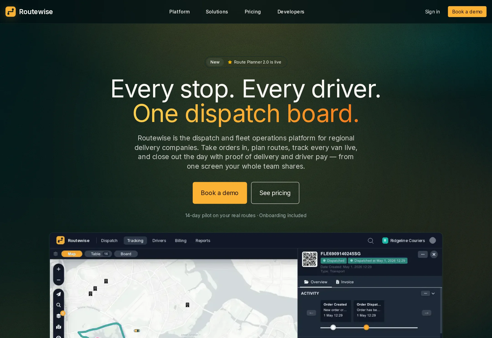

# Routewise

Dispatch and fleet operations for regional delivery companies — orders, live tracking, driver app and billing in one system.

**Live demo:** https://www.freelancerportfoliohub.com/jameslee/projects/routewise/index.html



## Overview

Routewise takes a delivery from booking to signed proof of delivery to invoice, so regional carriers
running 5 to 150 vehicles can retire the whiteboard, the group text and the spreadsheets. This
repository holds the product website and the sandbox API that backs the developer docs: order
intake, route optimization, quotes, nearby-driver lookup and the pricing estimator.

The site is organised around the delivery day: a hero built on the live-tracking view, a module grid
tied to real product screens, a dispatch section anchored on the workflow builder, and a developer
section with SDK examples. Pricing is laid out line by line — platform fee, per-active-vehicle rate,
metered usage and a worked estimate — so buyers can price their own fleet before a call.

## Features

- **Marketing site** — Home, Platform, Solutions (by industry, use case and role) and Pricing pages
- **Cost estimator** — live, line-by-line monthly estimate with annual billing and metered usage
- **No-JS fallbacks** — the mobile menu and FAQ are native `<details>` elements
- **Developer section** — tabbed SDK examples rendered by a small built-in syntax highlighter
- **Sandbox API** — typed route handlers with zod validation:
  - `GET/POST /api/orders`, `GET/PATCH /api/orders/:id` with an order status state machine
  - `POST /api/routes/optimize` — time-window-aware nearest-neighbour + 2-opt sequencing
  - `POST /api/quotes` — rate-card pricing with accessorials and minimum charges
  - `GET /api/drivers/nearby` — closest available drivers filtered by skills
  - `POST /api/pricing/estimate` — the same pricing engine the estimator uses
- **Signed webhooks** — HMAC-SHA256 signatures with timestamp replay protection
- **Data model** — Prisma schema for depots, customers, orders, stops, routes, drivers, vehicles and
  proof of delivery

## Tech stack

| Layer      | Choice                                                   |
| ---------- | -------------------------------------------------------- |
| Framework  | Next.js 15 (App Router), React 19                        |
| Language   | TypeScript (strict, `noUncheckedIndexedAccess`)          |
| Styling    | Tailwind CSS v4, amber-on-deep-teal design tokens        |
| Components | Hand-built primitives with `class-variance-authority`    |
| Icons      | lucide-react                                             |
| Validation | zod                                                      |
| Database   | PostgreSQL via Prisma                                    |

## Getting started

```bash
pnpm install
cp .env.example .env.local
pnpm db:migrate     # creates the schema in your local Postgres
pnpm db:seed        # loads the sandbox fleet
pnpm dev
```

Open http://localhost:3000.

### Environment variables

| Variable                   | Description                                               |
| -------------------------- | --------------------------------------------------------- |
| `DATABASE_URL`             | Postgres connection string used by Prisma                 |
| `ROUTEWISE_WEBHOOK_SECRET` | Shared secret for signing and verifying webhook payloads  |
| `NEXT_PUBLIC_SITE_URL`     | Canonical site URL for metadata and the sitemap           |

### Trying the API

```bash
curl -X POST http://localhost:3000/api/orders \
  -H 'content-type: application/json' \
  -d '{
    "reference": "SO-48213",
    "customerId": "cus_valley_home",
    "pickup":  { "address": "1420 Industrial Pkwy, Fresno, CA" },
    "dropoff": { "address": "88 W Olive Ave, Visalia, CA", "window": ["14:00", "16:00"] },
    "items":   [{ "sku": "PAL-STD", "qty": 2, "weight": 180 }],
    "proof":   ["PHOTO", "SIGNATURE"],
    "autoDispatch": true
  }'
```

## Project structure

```
.
├── app/                 # App Router pages, layout, global styles and API route handlers
│   ├── api/             # orders, routes/optimize, quotes, drivers/nearby, pricing/estimate
│   ├── platform/
│   ├── pricing/
│   └── solutions/
├── components/
│   ├── home/            # hero, module grid, dispatch showcase, developer section
│   ├── layout/          # header, mobile menu, footer, logo, background
│   ├── platform/
│   ├── pricing/         # plan card, cost estimator, support plans, FAQ
│   ├── shared/
│   ├── solutions/
│   └── ui/              # button, card, input, eyebrow, segmented toggle
├── lib/
│   ├── data/            # typed page content, price book, sandbox fleet
│   ├── routing/         # geo helpers and the route optimizer
│   └── services/        # order, quote and driver services
├── prisma/              # schema and seed script
├── public/              # product screenshots, textures, footer artwork
└── types/               # domain and content types
```

## Scripts

| Script             | Description                                  |
| ------------------ | -------------------------------------------- |
| `pnpm dev`         | Start the dev server with Turbopack          |
| `pnpm build`       | Generate the Prisma client and build         |
| `pnpm start`       | Serve the production build                   |
| `pnpm lint`        | Run ESLint (next/core-web-vitals)            |
| `pnpm typecheck`   | Type-check with `tsc --noEmit`               |
| `pnpm format`      | Format with Prettier                         |
| `pnpm db:migrate`  | Apply Prisma migrations in development       |
| `pnpm db:seed`     | Seed depots, customers, drivers and vehicles |
| `pnpm db:studio`   | Open Prisma Studio                           |
